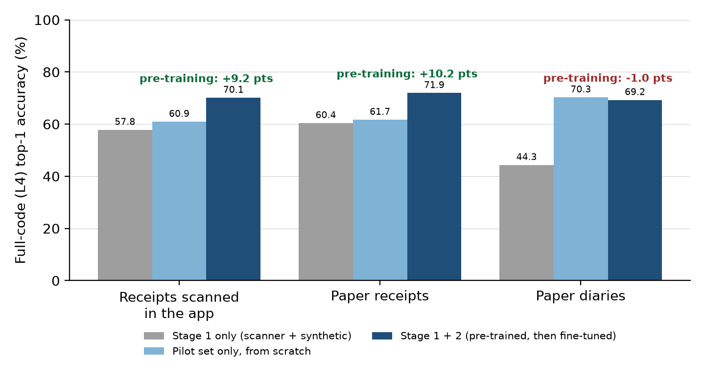

# Introduction

Household budget surveys, harmonised at European level by Eurostat [1], record for every purchase a short free-text description that must be coded into ECOICOP v2, the European Classification of Individual Consumption according to Purpose [2], identical to the UN COICOP 2018 [3] down to the fifth digit. In the survey studied here the classifier targets the fourth level, the sub-class (about 300 codes, from twelve divisions down), plus a few technical codes. Manual coding of hundreds of thousands of lines is slow, costly and inconsistent, so reliable automation is a prerequisite for the redesign of the survey.

This classifier is one component of a global pipeline for automatic coding of the survey^[A second abstract will be submitted to the conference to address this specific topic]. Its design is driven by one expectation: in the long run, receipts (paper receipts and receipts scanned in the app) should make up the majority of the data to code. The annotated data from the 2024 pilot are too few to train a good generalist model, especially before any evaluation set is available, but a large amount of similar data already exists: the retail scanner data collected for the consumer price index [4]. The first idea was therefore to train directly on them. The first results were not encouraging (48 % of full codes correct on the survey test set, 58 to 60 % on receipts), because scanner data are narrow and do not speak the language of the respondents. But the library we use, torchTextClassifiers (TTC) [5], makes it easy to reload a trained model and continue training its weights on a small annotated set: fine-tuning on the 2024 pilot lines alone brings the model to acceptable results (71 % of full codes correct on receipts, 70 % overall).^[This work is part of the ongoing developments within Work Package 10 ("From Text to Code") of the AIML4OS project [8].]

We report how the codes are distributed in each source, what each of the two stages brings, and how accuracy differs by collection channel (paper diaries, paper receipts, receipts scanned in the app).

# Methodology

## Data

**Approximate corpus (stage 1).** Scanner data collected from large retailers for the consumer price index [4] (January to August 2026) are de-duplicated on description, retailer variety and product family and mapped to ECOICOP through a retailer-family correspondence table: 10.3 million rows, 2.6 million distinct descriptions. To every level-4 code we add synthetic descriptions generated by an LLM from the official ECOICOP v2 labels, notes and exclusions (short, brand-realistic descriptions, about 210 per code). After text normalisation and de-duplication on (text, code) the corpus holds 1.8 million descriptions over 316 codes: 1.74 million from scanner data and 66 thousand synthetic.

**Annotated survey set (stage 2 and baseline).** We use only the annotated lines of the 2024 pilot, the data available at the start of the project: 12,767 lines over 310 level-4 codes (6,947 receipts scanned in the app, 5,410 lines from paper diaries, 410 app entries). The test set is the first wave of the 2026 survey, kept entirely apart: 16,293 coded lines, of which 14,695 are not resolved by the deterministic dictionary step of the production pipeline (90 %) and are evaluated here. They come from three channels: paper diaries (10,731 lines), paper receipts (1,980) and receipts scanned in the app (1,984).

## Where the codes are

The three sources do not cover the classification in the same way (Table 1). Scanner data are huge but narrow: retailers only sell goods, so 10.3 million rows fall into 105 of the 298 level-4 codes, dominated by food (31 %), recreation (25 %) and clothing (18 %), with transport services, restaurants, education and insurance absent. Synthetic data are thin but complete, about 210 descriptions per code; in the stage-1 corpus they are the *only* source for 211 of the 316 codes, so two thirds of the label space rests on 2 % of the rows. The annotated pilot set is food-heavy (53 % of lines) and very long-tailed: the median code has 11 lines and 277 of its 310 codes have fewer than 100. Stage 2 has to correct both the vocabulary and the class prior learnt in stage 1.

| | Raw scanner data | Stage-1 corpus | Annotated set |
|:-----------------------------------|----------:|----------:|----------:|
| Rows | 10,286,035 | 1,807,302 | 12,767 |
| Level-4 codes covered | 105 | 316 | 310 |
| Median examples per code | 41,063 | 316 | 11 |
| Share of the 10 largest codes | 47 % | 45 % | 34 % |
| Share of division 01 (food) | 31 % | 26 % | 53 % |
| Codes with fewer than 100 examples | 1 | 75 | 277 |

: Table 1. Distribution of ECOICOP level-4 codes in the raw scanner extraction, the stage-1 corpus (scanner + synthetic) and the annotated 2024 pilot set.

## Model and two-stage training

The model is a lightweight fastText-style classifier [6, 7] built with TTC, with about 13 million parameters, most of them in a single embedding table. It predicts the full level-4 code directly. Its small size is a practical benefit: it needs no GPU to run inference, and retraining remains cheap enough to be repeated at each consolidation of verified codes.

*Stage 1* trains the model from scratch on the approximate corpus. *Stage 2* reloads it and continues training all weights on the pilot set with a smaller learning rate. To isolate what stage 1 brings, we also train the same model from scratch on the pilot set alone.

## Evaluation protocol

The three models are evaluated on the same 14,695 test lines. Reference and predicted codes are truncated to level 4 (level-4 codes ending in .0 are folded into their parent), then to level *N*; a line is correct if the two agree, and the denominator is the same at every level. We report top-1 accuracy per level and top-5 accuracy (the usefulness of a candidate list for assisted coding), overall and by collection channel.

# Results and Practical Application

**Pre-training pays off on receipts.** Table 2 gives the overall picture. Trained on 1.8 million approximate examples only, the classifier reaches 48.3 % top-1 on the full code and 67.9 % at the division level on survey text; fine-tuning the same weights on the 12.8 thousand pilot lines lifts the full code to 69.7 % (+21.4 points). The question is what stage 1 adds over training on the pilot lines alone (67.8 %). Overall, +1.9 points (95 % interval +1.3 to +2.5), but this average hides two opposite effects (Table 3, Figure 1). On receipts, which are printed retail labels like the scanner data, pre-training adds **+10.2 points on paper receipts (interval +8.4 to +12.1) and +9.2 on receipts scanned in the app (+7.4 to +11.0)**, and the top-5 list improves by about 10 points: the pilot alone codes only 61 % of receipt lines, whereas the pre-trained and fine-tuned model reaches 71 to 72 %. On handwritten diaries, 73 % of the test lines, pre-training costs 1.0 point (interval −1.8 to −0.3) at top-1: their short free-text entries are learnt as well from the pilot annotations alone, and scanner data do not help (a model that has only seen scanner data reaches 44 % on diaries, against 58 to 60 % on receipts).

| Training | L1 top-1 | L2 top-1 | L3 top-1 | L4 top-1 | L4 top-5 |
|:------------------------------------------|-------:|-------:|-------:|-------:|-------:|
| Stage 1 only: 1.8 M scanner + synthetic descriptions | 67.9 | 64.0 | 54.6 | 48.3 | 65.0 |
| Pilot set only: 12.8 k lines, from scratch | 82.8 | 81.1 | 73.4 | 67.8 | 81.1 |
| Stage 1 + 2: fine-tuned on the 12.8 k pilot lines | **84.0** | **82.2** | **76.6** | **69.7** | **83.4** |

: Table 2. Accuracy (%) on the 14,695 test lines of the first 2026 wave that the dictionary step does not resolve. L1 = division, L4 = full code.

| Channel (test lines) | Stage 1 only | Pilot only | Stage 1 + 2 | Gain of stage 1 (top-1) |
|:-----------------------------------|---------:|---------:|---------:|---------:|
| Receipts scanned in the app (1,984) | 57.8 / 74.0 | 60.9 / 75.0 | **70.1** / **85.0** | **+9.2** |
| Paper receipts (1,980) | 60.4 / 75.5 | 61.7 / 77.3 | **71.9** / **87.2** | **+10.2** |
| Paper diaries (10,731) | 44.3 / 61.4 | **70.3 / 83.0** | 69.2 / 82.3 | −1.0 |
| All (14,695) | 48.3 / 65.0 | 67.8 / 81.1 | **69.7 / 83.4** | +1.9 |

: Table 3. Full-code accuracy (%) by collection channel, top-1 / top-5, and top-1 gain of pre-training (stage 1 + 2 minus pilot set only).

{width="11cm"}

**What the coding looks like.** Table 4 shows lines of the test set. Receipts are abbreviated and carry brands and quantities, and the model trained on the pilot alone often fails on them ("Netto couscous moyen ET. 1" is coded as a ready-made meal, "Cdf eau Micel bb bio", a micellar water, as drinking water), whereas the pre-trained model codes them like the annotators. On diaries, where the two models are close, each makes its own errors.

| Channel | Text as recorded | Reference code | Pilot only | Stage 1 + 2 |
|:------------|:----------------------------------|:------------------------|:------------------------|:------------------------|
| Paper receipt | Netto couscous moyen ET. 1 | 01.1.1.5 Pasta, couscous | 01.1.9.1 Ready-made food | **01.1.1.5** |
| Paper receipt | Cdf eau Micel bb bio | 13.1.2 Personal care products | 01.2.5 Water | **13.1.2** |
| App receipt | Chicorée soluble Leroux 200g | 01.2.2 Coffee and substitutes | 01.1.7.9 Vegetable preparations | **01.2.2** |
| App receipt | 50g Canard catisfa | 09.3.2.2 Pet products | 01.1.9.1 Ready-made food | **09.3.2.2** |
| Diary | Cotisation carte bancaire | 12.2.2 Explicit bank charges | 12.2.2 | **12.2.2** |
| Diary | Légumes maraicher | 01.1.7 Vegetables | **01.1.7** | 98.1.1 Fruit and vegetables (survey shopping code) |

: Table 4. Examples of lines of the test set (texts as recorded, before normalisation) with the reference code and the code predicted by two of the models.

**Pilot lines versus a larger annotated set.** Fine-tuning on the pilot reaches 71.0 % on receipts (paper and app pooled), as much as a comparable model fine-tuned on 113 thousand lines (the 2017 survey, the 2025 pilot and its coding tools: 71.3 %), whereas on diaries it reaches 69.2 % against 73.4 %: the older annotated lines matter for handwritten entries, not for receipts. Two caveats bound the figures: each configuration was trained once, so run-to-run variation is unknown; and 37 % of the test lines have a text that also occurs in the pilot set, which flatters the absolute figures.

# Main Findings

- Scanner data alone were not enough (48 % of full codes, 58 to 60 % on receipts), and the 12.8 thousand pilot lines alone are too few (68 % overall, 61 % on receipts). TTC makes it straightforward to fine-tune the scanner-trained weights on the pilot, which gives acceptable results (70 % overall) with a model small enough to run without a GPU.
- **Pre-training on scanner data pays off on receipts**: +10.2 points (paper) and +9.2 points (app) of full-code top-1 accuracy over training on the pilot lines alone, reaching 71.9 % and 70.1 %, with a top-5 list about 10 points better.
- On handwritten diaries, 73 % of the lines, pre-training does not help (−1.0 point): the overall gain is only +1.9 points (69.7 % against 67.8 %).
- Receipts reach the accuracy of a model fine-tuned on 113 thousand annotated lines (71.0 % against 71.3 %), whereas diaries still gain from the larger set (69.2 % against 73.4 %).
- For survey design: with receipts expected to dominate, a small annotated pilot is enough once the model is pre-trained on scanner data; keep annotating diary entries.

# References

1. Eurostat, *Household budget surveys — overview*, https://ec.europa.eu/eurostat/web/household-budget-surveys.
2. Eurostat / Publications Office of the European Union, *European Classification of Individual Consumption according to Purpose, version 2 (ECOICOP v2)*, EU Vocabularies, dataset *ecoicop*, https://op.europa.eu/en/web/eu-vocabularies.
3. United Nations Statistics Division, *Classification of Individual Consumption According to Purpose (COICOP) 2018*, Statistical Papers Series M No. 99, New York (2018).
4. M. Leclair, Utiliser les données de caisses pour le calcul de l'indice des prix à la consommation, *Courrier des statistiques* 3 (2019), 61–75, hal-05325782.
5. InseeFrLab, *torchTextClassifiers*, open-source PyTorch library for fastText-style text classification, https://github.com/InseeFrLab/torchTextClassifiers.
6. A. Joulin, E. Grave, P. Bojanowski and T. Mikolov, Bag of Tricks for Efficient Text Classification, *Proceedings of EACL 2017*, 427–431.
7. P. Bojanowski, E. Grave, A. Joulin and T. Mikolov, Enriching Word Vectors with Subword Information, *Transactions of the Association for Computational Linguistics* 5 (2017), 135–146.
8. AIML4OS (ESSnet on Artificial Intelligence and Machine Learning for Official Statistics), Work Package 10 "From Text to Code", https://aiml4os.github.io/WP10/ (repository: https://github.com/AIML4OS/WP10).
