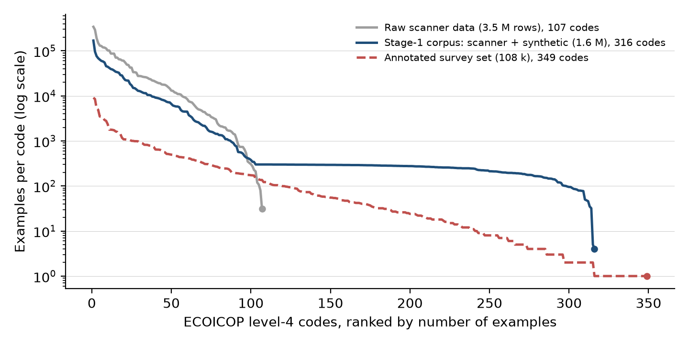
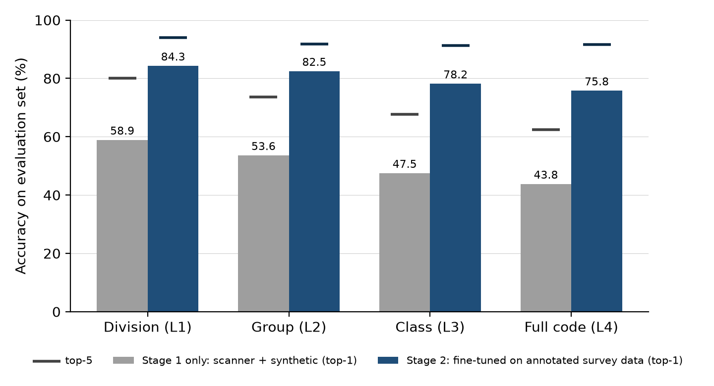

*Automatic coding · transfer learning · scanner data · fine-tuning · household budget survey · ECOICOP · torchTextClassifiers*

# Introduction

Household budget surveys, harmonised at European level by Eurostat [1], record for every purchase a short free-text description that must be coded into ECOICOP v2, the European Classification of Individual Consumption according to Purpose [2], identical to the UN COICOP 2018 [3] down to the fifth digit. In the survey studied here the classifier targets the fourth level, the sub-class (about 300 codes, from twelve divisions down), plus a few technical codes. Manual coding of hundreds of thousands of lines is slow, costly and inconsistent, so reliable automation is a prerequisite for the redesign of the survey.

The difficulty is not the classifier but the labels. While the instrument is being designed, in-domain annotated data is scarce, whereas *approximately* labelled text is abundant: retail scanner data associate millions of product descriptions with retailer categories that map to ECOICOP, and an LLM can generate descriptions for every category from the classification's definitions. Neither source speaks the language of a diary: receipts say "YAOURT NAT X8 500G" where a respondent writes "yaourts pour les enfants".

We present a deliberately simple two-stage recipe built on torchTextClassifiers (TTC) [5], an open-source PyTorch library of fastText-style classifiers [6, 7]: (1) pre-train a lightweight character n-gram classifier on the large approximate corpus; (2) fine-tune the *same* weights on the small annotated survey set. We report how the codes are distributed in each source, how much of the gap each stage closes, and how the recipe runs in production.

# Methodology

## Data

**Approximate corpus (stage 1).** Scanner data collected from large retailers for the consumer price index [4] (November 2025 to March 2026) are de-duplicated on description, retailer variety and product family and mapped to ECOICOP through a retailer-family correspondence table: 3.5 million rows, 2.2 million distinct descriptions. To every level-4 code we add synthetic descriptions generated by an LLM from the official ECOICOP v2 labels, notes and exclusions (up to 300 short, brand-realistic descriptions per code). After text normalisation and de-duplication on (text, code) the corpus holds 1.6 million descriptions over 316 codes: 1.52 million from scanner data and 74 thousand synthetic.

**Annotated survey set (stage 2).** The in-domain set combines 93 thousand lines coded manually in the previous wave of the survey (2017) with 14.6 thousand lines from the 2025 pilot and its coding tools (app receipts, diary and app entries, a curated product list). Lines whose code was never seen in stage 1 are dropped (fine-tuning keeps the pre-trained label space): 107,063 of the 107,886 lines, over 287 codes, remain. A further 7,972 pilot-only lines form the test set. All texts share one normalisation: transliteration, lower-casing, removal of punctuation, digits and noise tokens, token de-duplication and a domain stop-word list.

## Where the codes are

The three sources do not cover the classification in the same way (Figure 1, Table 1). Scanner data are huge but narrow: retailers only sell goods, so 3.5 million rows fall into 107 of the 298 level-4 codes, dominated by recreation (27 %), food (26 %) and clothing (23 %), with transport services, restaurants, education and insurance absent. Synthetic data are thin but complete, about 240 descriptions per code; in the stage-1 corpus they are the *only* source for 209 of the 316 codes, so two thirds of the label space rests on 3 % of the rows. The annotated survey set is food-heavy (63 % of lines) and long-tailed. Stage 2 has to correct both the vocabulary and the class prior learnt in stage 1.

{width="11cm"}

| | Raw scanner data | Stage-1 corpus | Annotated set |
|:-----------------------------------|----------:|----------:|----------:|
| Rows | 3,471,004 | 1,595,831 | 107,886 |
| Level-4 codes covered | 107 | 316 | 349 |
| Median examples per code | 10,994 | 292 | 37 |
| Share of the 10 largest codes | 49 % | 46 % | 43 % |
| Share of division 01 (food) | 26 % | 24 % | 63 % |
| Codes with fewer than 100 examples | 2 | 18 | 230 |

: Table 1. Distribution of ECOICOP level-4 codes in the raw scanner extraction, the stage-1 corpus (scanner + synthetic) and the annotated survey set.

## Model and two-stage training

The backbone is a fastText-style classifier: character 3- to 6-grams hashed into a 100,000-entry vocabulary feed a 128-dimensional embedding table, mean-pooled into a linear head trained with cross-entropy and Adam. The classifier is *flat*: it predicts the full level-4 code directly, and the coarser levels are read off the prediction.

*Stage 1* trains the classifier from scratch on the approximate corpus with early stopping on a 20 % held-out slice (batch 512, learning rate 10^-3^, 12 epochs in the production run). *Stage 2* reloads the model, freezes the tokenizer and label space, and continues training *all* weights on the annotated set with the learning rate divided by ten, a stratified 80/20 split and early stopping (patience 3); the production run stopped after 92 epochs. Each stage is a single command of the library and takes minutes on a CPU node.

## Evaluation protocol

Both stages are evaluated on the same 7,161 pilot test lines that the deterministic dictionary step of the production pipeline does not resolve (90 % of the test set). Coders annotate to the depth they can justify, so accuracy at level *N* is computed on the lines annotated at least to depth *N* (7,161 at level 1, about 6,100 at level 4). We report top-1 accuracy per level and top-5 accuracy on the full code (the usefulness of a candidate list for assisted coding).

# Results and Practical Application

{width="11cm"}

**Fine-tuning closes most of the domain gap.** Trained on 1.6 million approximate examples only, the classifier reaches 43.8 % top-1 on the full code and 58.9 % at the division level on survey text (Figure 2, Table 2). Fine-tuning the same weights lifts full-code accuracy to 75.8 % (+32 points) and division accuracy to 84.3 %; top-5 accuracy on the full code rises from 62 % to 92 %.

| Training | L1 top-1 | L2 top-1 | L3 top-1 | L4 top-1 | L4 top-5 |
|:------------------------------------------|-------:|-------:|-------:|-------:|-------:|
| Stage 1 only: 1.6 M scanner + synthetic descriptions | 58.9 | 53.6 | 47.5 | 43.8 | 62.4 |
| Stage 1 + 2: fine-tuned on 107 k annotated lines | **84.3** | **82.5** | **78.2** | **75.8** | **91.7** |

: Table 2. Accuracy (%) of the classifier on the pilot test lines not resolved by the dictionary step (7,161 lines, about 6,100 annotated to level 4). L1 = division, L4 = full code.

**More approximate data helps little; longer fine-tuning helps a lot.** Enlarging the stage-1 corpus moves full-code accuracy on survey text by a few points at most: scanner data alone (221 thousand descriptions) give 45.3 %, scanner plus synthetic (1.5 million) 45.6 %, and adding a million descriptions from an open barcode (GTIN) database 48.5 %. Fine-tuning, in contrast, is sensitive to its length: on the first pilot set, one epoch at the reduced learning rate leaves full-code accuracy unchanged (47.4 % against 47.5 %), whereas letting early stopping decide (about 220 epochs) brings it to 87.4 %.

**In production, and limits.** The fine-tuned flat model is called by a batch step of the survey's coding workflow; its top-5 list, with the outputs of the dictionary step and of two retrieval-based classifiers, feeds a conciliation step that decides whether a line is coded automatically or sent to a coder, and the model is retrained at each consolidation of verified codes. Three caveats bound the figures: the label space is fixed at stage 1, so the 70 codes of the annotated set that appear in neither scanner nor synthetic data (0.8 % of its lines) can never be predicted; the evaluation excludes lines resolved by the dictionary step, so end-to-end accuracy is higher; and the classifier has not yet been trained from scratch on the annotated set alone, the baseline that would isolate the contribution of stage 1.

# Main Findings

- Approximate supervision is abundant only where retailers sell: scanner data cover a third of the ECOICOP codes, and synthetic descriptions restore coverage, not the distribution. A lightweight fastText-style classifier trained on this corpus reaches about 44 % top-1 on the full code of household budget diaries.
- Fine-tuning the same weights on the survey's annotated lines is the decisive lever: +32 points on the full code (75.8 %), 84 % at the division level, and a top-5 list containing the right code in 92 % of cases.
- The gain comes from the annotated data and from long, low-learning-rate fine-tuning, not from the size of the approximate corpus: enlarging it moves full-code accuracy by a few points at most.
- For survey design: invest in consolidating verified codes as the campaign progresses and in a retraining loop cheap enough to run at each consolidation, rather than in larger pre-training corpora.

::: {.callout-note collapse="false"}
## Side note for the authors (delete before submission)

*Earlier pilot-only results.* The March 2026 experiments fine-tuned the 1.5 million-description model on the first pilot set only (11,491 lines for training, 2,873 for validation, 240 codes) and evaluated on a separate 3,578-line pilot file: full-code top-1 rose from 48.2 % to 87.4 % and top-5 to 95.7 %. Those numbers are higher than the headline ones because that evaluation file is easier (no dictionary-step filtering, fewer sources) and is not the consolidated test split; they are not comparable and are therefore kept out of the tables.

*Missing baseline.* MLflow has no completed run that trains the flat classifier from scratch on the annotated set alone (the only attempt, experiment `ttc-basic`, stopped after one epoch). To produce it on the same evaluation set as the headline runs:

```bash
cd codif-ttc/
uv run python main.py train-basic \
  --data raw_train_processed.parquet --code-column code8 --text-column product \
  --embedding-dim 128 --batch-size 512 --lr 0.001 --num-epochs 500 --patience 5 \
  --eval-data raw_test_without_regex.parquet --eval-text-column l_pr_product \
  --mlflow-experiment ttc-basic-from-scratch
```

then add its `eval_level4_top-1` as a third row of Table 2. If it lands well below 75.8 %, stage 1 is doing real work; if it lands close, the story becomes "annotated data is all you need, pre-training buys speed and coverage".
:::

# References

1. Eurostat, *Household budget surveys — overview*, https://ec.europa.eu/eurostat/web/household-budget-surveys.
2. Eurostat / Publications Office of the European Union, *European Classification of Individual Consumption according to Purpose, version 2 (ECOICOP v2)*, EU Vocabularies, dataset *ecoicop*, https://op.europa.eu/en/web/eu-vocabularies.
3. United Nations Statistics Division, *Classification of Individual Consumption According to Purpose (COICOP) 2018*, Statistical Papers Series M No. 99, New York (2018).
4. M. Leclair, Utiliser les données de caisses pour le calcul de l'indice des prix à la consommation, *Courrier des statistiques* 3 (2019), 61–75, hal-05325782.
5. InseeFrLab, *torchTextClassifiers*, open-source PyTorch library for fastText-style text classification, https://github.com/InseeFrLab/torchTextClassifiers.
6. A. Joulin, E. Grave, P. Bojanowski and T. Mikolov, Bag of Tricks for Efficient Text Classification, *Proceedings of EACL 2017*, 427–431.
7. P. Bojanowski, E. Grave, A. Joulin and T. Mikolov, Enriching Word Vectors with Subword Information, *Transactions of the Association for Computational Linguistics* 5 (2017), 135–146.
