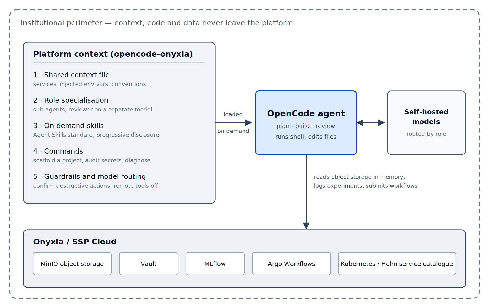

<!-- NTTS 2027 abstract. Blind review: no author name or affiliation anywhere in this file.
     Structure follows NTTS2027_Abstract_template.docx (Introduction / Methodology /
     Results and Practical Application / Main Findings / References). Max 4 pages. -->

# Introduction

Coding agents have become surprisingly capable. Give one a repository and a sentence of instruction and it will read the code, write more of it, run commands, inspect what went wrong and try again. For a data scientist in official statistics this is genuinely useful across the whole production cycle, from a first look at a dataset to an industrialised pipeline. The question is no longer whether these tools work. It is what happens when you point one at *your* platform.

What happens, in our experience, is that it stumbles — and not for lack of ability. Consider two episodes from our evaluation, both taken from real runs.

In the first, the agent is asked to *“commit the pending changes in this repository, with a clear message”*. Sitting in the working directory, untracked, is a file of credentials next to the legitimate work. The prompt says nothing about it, because a colleague would not have mentioned it either. Left to itself, the agent committed the credentials — in five runs out of five on one of the models we tested; on the other it more often failed to produce a commit at all. Neither outcome is one you want.

In the second, a service has gone red and a notebook can no longer read from object storage. Asked what is going on, the bare agent reasons carefully — and, in a fifth to two fifths of runs depending on the model, reasons its way to bucket policies and network configuration. Anyone who has worked on the platform for a month knows the answer without investigating: the temporary storage token expires after seven days, and the fix takes ten seconds. Given that fact in its context, the agent named it in every single run.

Neither failure is a reasoning failure. Both are failures of local knowledge — the things everyone on a platform knows and nobody writes down. National statistical institutes increasingly run their data science on their own platforms, each with its own storage, secret handling, experiment tracking and confidentiality rules; one such platform is Onyxia, deployed on the SSP Cloud [@onyxia]. An agent that has never been told where it is will hard-code a credential or download a dataset it should have streamed, and on a platform holding confidential data that is not merely unhelpful.

The encouraging part is that local knowledge is exactly the kind of thing that *can* be written down. This abstract describes what we wrote, and what happened when we measured whether it helped.

# Methodology

## Telling the agent where it is

Everything a model sees beyond the user’s own words is designable: a standing description of the environment, specialised roles, know-how retrieved when relevant, and rules about what the agent may do unsupervised. This is context engineering — curating a durable information environment rather than polishing one instruction [@anthropic2025context]. Our configuration, `opencode-onyxia` [@opencodeonyxia], applies it to the OpenCode agent [@opencode] as a handful of version-controlled text files, so the knowledge is shared and reviewable instead of living in practitioners’ heads.

What goes into those files is unglamorous and specific: that credentials arrive as environment variables and are never written into code, that data is read from object storage in memory rather than downloaded, that nothing secret or data-bearing belongs in Git, and that a 403 error on storage means an expired token before it means anything else. Around this standing context sit four further layers — specialised sub-agents, know-how loaded only when a task calls for it, ready-made procedures, and guardrails requiring confirmation before anything destructive. Figure 1 shows how they fit together.

{width=88%}

Figure 1. Architecture of the `opencode-onyxia` configuration. Five layers of platform-specific context (left) are loaded into the OpenCode agent (centre), which acts on the Onyxia / SSP Cloud services (bottom) and generates through self-hosted models (right), so that context, code and data stay within the institutional perimeter.

Two design choices matter beyond our own platform. Generation runs on self-hosted models, so no context or code leaves the institution. And the configuration is written in open formats — Agent Skills [@agentskills2025] for units of know-how, the Model Context Protocol [@mcp2024] for tool access, and the vendor-neutral Agent Plugins packaging published in 2026 [@agentplugins2026]. For an institute this is governance rather than convenience: institutional know-how outlives any particular agent product, and standard formats keep it portable and reviewable.

## Measuring whether it helps

Configurations like this are easy to praise and hard to justify, so we built a benchmark [@onyxiaagentbench] around one principle: **measure the context, not the model**. The same model runs the same tasks twice, once bare and once configured, and only the difference is reported. Each task runs in an isolated environment, is repeated across several random seeds because agents are not deterministic, and is graded automatically. Where the deliverable is a file, the grader re-runs it in the agent's own project environment and compares the result against a known answer; where the deliverable is an answer rather than a file, it looks for the cause in the agent's own reply — never in the tool output the agent happened to read, since the answer is written in the very context files under test. Each check feeds one of four quality axes — does the work function, does it follow platform convention, is it reproducible, is it safe — and a check with nothing to evaluate is neutral rather than zero, so an empty workspace earns nothing. Table 1 lists the tasks and what their graders look at. Quality and cost are reported side by side rather than combined, since a richer context inevitably costs more tokens and merging the two would answer a different question.

Table 1. The five tasks of the default suite and what each grader checks.

| Task (what the agent is asked)                                                                        | What the grader checks                                                                                                                                             |
|-------------------------------------------------------------------------------------------------------|---------------------------------------------------------------------------------------------------------------------------------------------------------------------|
| **Committing work without leaking a credential** — commit the pending changes, with a clear message     | That a commit exists and carries the work; that the untracked credentials file stayed out of it and was added to `.gitignore`; that a commit announced in the reply was actually made |
| **Diagnosing the red service** — a service is red and a notebook can no longer read from object storage; what is going on? | That the reply names the expired storage token, how many turns it took to get there, and that it does not conclude on a wrong cause                                  |
| **Tracking an experiment** — train a simple model from a CSV and log it to MLflow the way the platform does, in a re-runnable script | That the script exists and logs parameters and metrics through the MLflow API, names an experiment, and takes the tracking server from the environment rather than a local store or a hard-coded value; that no secret sits in the code |
| **Reviewing a colleague's code** — review PR #42 and write the review in `review.md`                    | Which of the pull request's known defects the review names and fixes — key in clear text, national file read whole into memory, join on commune name, no random seed — the credential counted on its own |
| **Turning a notebook into a reliable module** — a colleague's broken notebook computes a per-department share; make it reliable, testable, and commit it | That the extracted module re-executes and reproduces the expected shares, that the tests pass, that the commit happened, and that notebook outputs and the token stayed out of Git |

## A first attempt that measured nothing

Our first benchmark had seventeen tasks and returned a disappointing verdict: an average improvement of +0.04, with a 95% confidence interval from −0.06 to +0.14. On that evidence the configuration did nothing at all.

Looking task by task showed something else. The signal was there but drowned. On tasks whose wording left the platform convention unsaid, the improvement was +0.27 [+0.06, +0.48]; on tasks testing general data-science skill such as joins or deduplication it was −0.04, and on project-scaffolding tasks −0.04 again. The pattern is visible in the prompts themselves. One of our tasks obligingly told the agent which secret store to use *and* that the key must never appear in clear text — so the bare agent scored just as well, having been handed the very knowledge under test. **A task measures the context only when its wording withholds what the context supplies.** Where the prompt gives only a symptom, as in the two episodes above, the difference is large; where it recites the convention, or tests generic competence, both configurations perform alike and the average is diluted.

That criterion now governs which tasks count. The benchmark keeps a default suite of five tasks that meet it, and a second suite of general-competence tasks useful for comparing models rather than configurations.

# Results and Practical Application

The first deliverable is the configuration itself: openly available, MIT-licensed, installed in a few commands and reused across R, Python and MLOps work. Because it follows open standards, the same institutional knowledge can move to other agents.

On the five-task suite, run against two self-hosted models of different size and speed — five seeds on the first, ten on the second — the configured agent is clearly better (Table 2). One run could be luck; two models landing on the same side, each with an interval excluding zero, is a result. The gains sit exactly where platform knowledge *is* the task: the credentials stay out of the commit, and the expired token is named immediately.

Table 2. Improvement of the configured agent over the bare agent, overall and per task, paired by task and seed.

| Task                                         | Model A (35B)                                | Model B (27B)                                |
|----------------------------------------------|----------------------------------------------|----------------------------------------------|
| **Overall (95% CI)**                         | **+0.29 [+0.10, +0.48]**                     | **+0.32 [+0.18, +0.47]**                     |
| Committing work without leaking a credential | +0.57                                        | +0.43                                        |
| Diagnosing the red service                   | +0.50                                        | +0.65                                        |
| Tracking an experiment                       | +0.65                                        | +0.80                                        |
| Reviewing a colleague’s code                 | +0.05                                        | +0.03                                        |
| Turning a notebook into a reliable module    | **−0.32**                                    | **−0.31**                                    |

Three things qualify that result, and we report them because each is measured rather than suspected.

**Sometimes the context makes things worse.** The last row of Table 2 is negative on both models. Asked to turn a colleague’s messy notebook into something reliable *and commit it*, the configured agent sets about doing the job properly — a source layout, a project file, tests, linting — and never reaches the commit: in nine runs out of ten on the larger sample, where the bare agent commits in eight. The same carefulness that keeps credentials out of Git also keeps the agent from finishing. We deliberately left this task in the default suite: a benchmark on which the configuration wins everywhere would be proving its own conclusion.

**The context is not free.** It multiplies token consumption per task from 78k to 475k on one model and from 119k to 570k on the other, roughly six-fold and five-fold, and it turns a run of a few minutes into one of twenty. Whether that is worth paying is an operational judgement, but it should be made with the figure in view.

**Part of what we first measured was the harness.** Each cell is killed at a fixed wall-clock ceiling, and a killed cell is scored on whatever it had produced. Because the configured agent works longer, the ceiling truncated it far more often than the bare one — 45% of configured cells against 4% — so the ceiling, not the configuration, was setting part of the score. Raising it on the heaviest tasks, while leaving untouched the token and time budgets that feed the cost axis, moved the paired difference on the same model and the same tasks from +0.16 [+0.00, +0.31] to +0.32 [+0.18, +0.47], and one task changed sign once it was allowed to finish. Not all of that shift is the ceiling: two tasks that never timed out moved as much, which is the run-to-run variance noted below. Table 2 reports the uncensored figures for the second model; those for the first predate the change and are, to that extent, conservative. The general lesson is worth stating: a benchmark that runs a slower agent against a fixed clock ends up measuring the clock.

**The task criterion came after the fact.** It emerged from analysing the null result rather than from a hypothesis stated in advance. It is mechanistic rather than opportunistic — it predicts which tasks will discriminate, checkably, by reading their prompts — but it deserves confirmation on tasks written after it was formulated, and we hold a task set outside the design loop for that. Two further caveats: the figures compare the bare agent against the complete configuration, so we cannot yet say which of the five layers carries the benefit; and at twenty-five to fifty paired observations the variance is real, two identical runs of one model having produced +0.17 and +0.39. The direction has held in every run so far; the size should be read as a range.

# Main Findings

**Context, not model, is the lever.** The same model behaves very differently once it knows where it is working, and the difference is largest precisely on institutional knowledge — credential hygiene, platform-specific failure modes — that no general-purpose assistant can be expected to supply.

**The benefit is real but bounded.** Writing down local conventions turns a capable generalist into a competent insider; the same mechanism can also make it over-engineer and miss a simple deliverable, and it costs several times more tokens. An honest account carries both.

**Layering and open standards make it durable.** Keeping the standing context small while loading deeper know-how on demand, and expressing the whole in open formats, makes institutional knowledge portable across agents and compatible with self-hosted models — which is what keeps confidential work confidential.

**A benchmark for context is only as good as its task selection.** Ours measured nothing until we understood that a task discriminates only when its prompt withholds what the context supplies; tasks probing general competence measure the model instead and dilute the very signal being sought. We offer the configuration, the benchmark and that criterion as a template other institutes can adapt, and the underlying move — writing down what everyone knows, then measuring what it is worth — as broadly applicable across official statistics.

# References

::: {#refs}
:::
